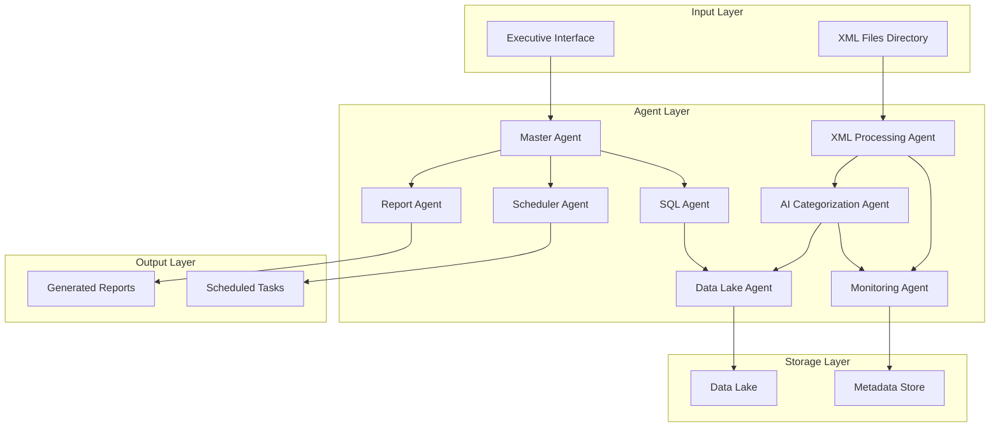

# Design Document

## Overview

The AI Agents Invoice Analysis System is designed as a multi-agent architecture that processes Brazilian electronic invoices (NF-e XML format) to provide strategic fiscal insights for C-level executives. The system transforms raw XML data into a structured knowledge base and offers natural language querying capabilities with automated report generation and scheduling.

## Architecture

### High-Level Architecture



### Multi-Agent Architecture

The system employs a coordinated multi-agent approach based on the requirements:

1. **Master Agent**: Central orchestrator that interprets user intentions and coordinates other agents (Requirement 3, 4, 5)
2. **XML Processing Agent**: Automatically processes XML files from central directory and extracts fiscal data (Requirement 1)
3. **AI Categorization Agent**: Applies machine learning to categorize products, suppliers, and operations automatically (Requirement 2)
4. **SQL Agent**: Translates natural language queries into SQL statements for data analysis (Requirement 3)
5. **Report Agent**: Generates executive-level reports in multiple formats (.xlsx, .pdf, .docx) (Requirement 4)
6. **Scheduler Agent**: Manages automated recurring tasks and CronJob creation for scheduled reports (Requirement 5)
7. **Data Lake Agent**: Manages data storage, integrity, and provides optimized access for analytics (Requirement 6)
8. **Monitoring Agent**: Handles error logging, administrator notifications, and system health monitoring (Requirement 1)

## Components and Interfaces

### XML Processing Agent

**Purpose**: Autonomous agent that processes Brazilian fiscal XML files (NF-e and NFS-e) and extracts structured data (Requirement 1)

**Key Features**:
- Monitors central directory for new XML files automatically
- Detects document type (NF-e vs NFS-e) and validates against schemas
- Extracts fiscal data including products/services, suppliers, taxes, and operations
- Handles both mandatory and optional fields for each document type
- Communicates with Monitoring Agent for error handling and notifications

**Interface**:
```python
class XMLProcessingAgent:
    def monitor_directory(self, directory_path: str) -> None
    def process_xml_file(self, file_path: str) -> Union[NFEData, NFSEData]
    def detect_document_type(self, xml_content: str) -> DocumentType
    def validate_schema(self, xml_content: str, doc_type: DocumentType) -> bool
    def extract_fiscal_data(self, xml_content: str, doc_type: DocumentType) -> Union[NFEData, NFSEData]
    def notify_processing_complete(self, data: Union[NFEData, NFSEData]) -> None
    def handle_processing_error(self, error: ProcessingError) -> None
```

### AI Categorization Agent

**Purpose**: Autonomous agent that applies machine learning to categorize and analyze fiscal data from both NF-e and NFS-e (Requirement 2)

**Key Features**:
- Automatically categorizes products using NLP and classification algorithms (NF-e)
- Categorizes services using CNAE and NBS codes (NFS-e)
- Classifies suppliers by type, region, and business relationship
- Categorizes tax operations (ICMS, IPI, PIS, COFINS for NF-e; ISSQN for NFS-e)
- Detects patterns and trends across both document types automatically
- Adapts classification model when new categories emerge

**Interface**:
```python
class AICategorization Agent:
    def process_fiscal_data(self, data: Union[NFEData, NFSEData]) -> CategorizedFiscalData
    def categorize_products(self, products: List[Product]) -> List[CategorizedProduct]
    def categorize_services(self, services: List[Service]) -> List[CategorizedService]
    def classify_suppliers(self, suppliers: List[Supplier]) -> List[ClassifiedSupplier]
    def detect_patterns(self, fiscal_data: Union[NFEData, NFSEData]) -> List[Pattern]
    def adapt_classification_model(self, new_categories: List[Category]) -> None
    def analyze_tax_efficiency(self, documents: List[FiscalDocument]) -> TaxAnalysis
```

### Master Agent

**Purpose**: Central coordinator that interprets user intentions and orchestrates other agents

**Key Features**:
- Natural language understanding for executive queries
- Intent recognition and routing
- Task coordination between specialized agents
- User interaction management

**Interface**:
```python
class MasterAgent:
    def interpret_query(self, natural_language_query: str) -> Intent
    def route_to_agent(self, intent: Intent) -> AgentResponse
    def coordinate_workflow(self, workflow: Workflow) -> WorkflowResult
    def present_to_user(self, result: Any) -> UserPresentation
```

### SQL Agent

**Purpose**: Converts natural language business questions into SQL queries

**Key Features**:
- Business language to SQL translation
- Query optimization for Data Lake structure
- Preview generation for user validation
- Complex query handling for fiscal analysis

**Interface**:
```python
class SQLAgent:
    def generate_sql(self, business_question: str) -> SQLQuery
    def optimize_query(self, query: SQLQuery) -> OptimizedSQLQuery
    def validate_syntax(self, query: SQLQuery) -> ValidationResult
    def execute_query(self, query: SQLQuery) -> QueryResult
```

### Report Agent

**Purpose**: Generates executive-level reports in multiple formats

**Key Features**:
- Multi-format report generation (.xlsx, .pdf, .docx)
- Executive-level data visualization
- Template-based report creation
- Chart and graph generation

**Interface**:
```python
class ReportAgent:
    def generate_report(self, data: QueryResult, format: ReportFormat) -> Report
    def create_visualizations(self, data: QueryResult) -> List[Visualization]
    def apply_executive_template(self, report: Report) -> FormattedReport
    def export_report(self, report: Report, format: ReportFormat) -> bytes
```

### Scheduler Agent

**Purpose**: Manages automated recurring tasks and report scheduling (Requirement 5)

**Key Features**:
- Creates automated recurring tasks for scheduled reports
- Generates CronJob expressions for specified frequencies
- Executes queries automatically at specified intervals
- Delivers reports to designated recipients
- Manages schedule conflict resolution

**Interface**:
```python
class SchedulerAgent:
    def create_recurring_task(self, query: SQLQuery, frequency: str, recipients: List[str]) -> ScheduledTask
    def generate_cron_expression(self, frequency: str) -> str
    def execute_scheduled_task(self, task: ScheduledTask) -> TaskResult
    def deliver_scheduled_report(self, report: Report, recipients: List[str]) -> DeliveryResult
    def manage_task_lifecycle(self, task: ScheduledTask) -> None
```

### Data Lake Agent

**Purpose**: Manages centralized data storage, integrity, and provides optimized access for analytics (Requirement 6)

**Key Features**:
- Stores structured fiscal data with integrity and consistency
- Preserves historical information for trend analysis
- Maintains referential integrity between invoices, suppliers, and products
- Provides optimized access for complex queries and advanced analytics
- Manages data lifecycle and archiving policies

**Interface**:
```python
class DataLakeAgent:
    def store_fiscal_data(self, data: Union[NFEData, NFSEData]) -> StorageResult
    def maintain_data_integrity(self) -> IntegrityCheckResult
    def preserve_historical_data(self, data: FiscalData) -> None
    def maintain_referential_integrity(self) -> None
    def optimize_query_access(self, query: SQLQuery) -> OptimizedQuery
    def perform_advanced_analytics(self, analytics_request: AnalyticsRequest) -> AnalyticsResult
```

### Monitoring Agent

**Purpose**: Handles error logging, administrator notifications, and system health monitoring (Requirement 1)

**Key Features**:
- Logs XML processing errors and system failures
- Sends notifications to administrators when critical errors occur
- Monitors system health and agent performance
- Tracks processing statistics and system metrics
- Manages alert escalation and recovery procedures

**Interface**:
```python
class MonitoringAgent:
    def log_processing_error(self, error: ProcessingError) -> None
    def notify_administrators(self, alert: SystemAlert) -> NotificationResult
    def monitor_system_health(self) -> HealthStatus
    def track_agent_performance(self, agent_id: str) -> PerformanceMetrics
    def manage_alert_escalation(self, alert: SystemAlert) -> EscalationResult
    def initiate_recovery_procedure(self, failure: SystemFailure) -> RecoveryResult
```

## Data Models

### Core Data Models

```python
from enum import Enum
from typing import Union

class DocumentType(Enum):
    NFE = "NFE"
    NFSE = "NFSE"

@dataclass
class NFEData:
    chave_nfe: str
    numero_nf: str
    serie: str
    supplier: Supplier
    recipient: Recipient
    products: List[Product]
    taxes: List[Tax]
    total_amount: Decimal
    issue_date: datetime
    xml_source: str
    document_type: DocumentType = DocumentType.NFE

@dataclass
class NFSEData:
    id_nfse: str
    numero_nfse: str
    numero_dfse: str
    supplier: Supplier
    recipient: Recipient
    services: List[Service]
    issqn_tax: ISSQNTax
    total_amount: Decimal
    issue_date: datetime
    xml_source: str
    document_type: DocumentType = DocumentType.NFSE

@dataclass
class Supplier:
    cnpj: str
    cpf: str
    name: str
    trade_name: str
    address: Address
    category: str
    region: str
    municipal_registration: str

@dataclass
class Product:
    code: str
    description: str
    ncm: str
    cfop: str
    category: str
    unit_price: Decimal
    quantity: Decimal
    tax_classification: str

@dataclass
class Service:
    code: str
    description: str
    cnae: str
    nbs_code: str
    category: str
    unit_price: Decimal
    quantity: Decimal
    municipal_tax_code: str
    national_tax_code: str

@dataclass
class Tax:
    tax_type: str  # ICMS, IPI, PIS, COFINS
    rate: Decimal
    amount: Decimal
    base_value: Decimal

@dataclass
class ISSQNTax:
    rate: Decimal
    amount: Decimal
    base_value: Decimal
    credit_value: Decimal
    municipality_code: str

@dataclass
class QueryResult:
    data: List[Dict[str, Any]]
    metadata: QueryMetadata
    execution_time: float
    row_count: int
    document_types: List[DocumentType]
```

### Data Lake Schema

The Data Lake will be organized to handle both NF-e (Nota Fiscal Eletrônica - Products) and NFS-e (Nota Fiscal de Serviços Eletrônica - Services) following their respective official Brazilian XML schema structures, optimized for PostgreSQL/Supabase:

```sql
-- Document type control table
CREATE TABLE dim_tipo_documento (
    tipo VARCHAR(10) PRIMARY KEY,
    descricao VARCHAR(100),
    created_at TIMESTAMPTZ DEFAULT NOW(),
    updated_at TIMESTAMPTZ DEFAULT NOW()
);

INSERT INTO dim_tipo_documento VALUES 
('NFE', 'Nota Fiscal Eletrônica - Produtos'),
('NFSE', 'Nota Fiscal de Serviços Eletrônica - Serviços');

-- Enable Row Level Security (RLS) for Supabase
ALTER TABLE dim_tipo_documento ENABLE ROW LEVEL SECURITY;

-- NF-e main table (based on official schema)
CREATE TABLE nfe_main (
    chave_nfe VARCHAR(44) PRIMARY KEY,  -- TChNFe: 44-digit NFe key
    numero_nf VARCHAR(9),               -- TNF: Invoice number (1-9 digits)
    serie VARCHAR(3),                   -- TSerie: Series (0-999)
    modelo VARCHAR(2) DEFAULT '55',     -- TMod: Model (always 55 for NFe)
    data_emissao DATE,                  -- Issue date
    data_saida_entrada DATE,            -- Exit/Entry date
    tipo_operacao CHAR(1),              -- 0=Entry, 1=Exit
    codigo_municipio VARCHAR(7),        -- TCodMunIBGE: IBGE municipality code
    uf_emitente VARCHAR(2),             -- TUfEmi: Issuer state
    natureza_operacao VARCHAR(60),      -- Operation nature
    forma_pagamento CHAR(1),            -- Payment method
    valor_total_nf NUMERIC(15,2),       -- Total invoice value
    valor_total_produtos NUMERIC(15,2), -- Total products value
    valor_total_servicos NUMERIC(15,2), -- Total services value
    base_calculo_icms NUMERIC(15,2),    -- ICMS calculation base
    valor_icms NUMERIC(15,2),           -- ICMS value
    base_calculo_icms_st NUMERIC(15,2), -- ICMS ST calculation base
    valor_icms_st NUMERIC(15,2),        -- ICMS ST value
    valor_total_ipi NUMERIC(15,2),      -- Total IPI value
    valor_pis NUMERIC(15,2),            -- PIS value
    valor_cofins NUMERIC(15,2),         -- COFINS value
    xml_file_path VARCHAR(500),         -- Original XML file path
    processed_at TIMESTAMPTZ DEFAULT NOW(),
    created_at TIMESTAMPTZ DEFAULT NOW(),
    updated_at TIMESTAMPTZ DEFAULT NOW()
);

ALTER TABLE nfe_main ENABLE ROW LEVEL SECURITY;
);

-- Emitter (supplier) dimension table
CREATE TABLE dim_emitente (
    cnpj VARCHAR(14) PRIMARY KEY,       -- TCnpj: 14-digit CNPJ
    cpf VARCHAR(11),                    -- TCpf: 11-digit CPF (for individuals)
    inscricao_estadual VARCHAR(14),     -- TIe: State registration
    razao_social VARCHAR(60),           -- Company name
    nome_fantasia VARCHAR(60),          -- Trade name
    logradouro VARCHAR(60),             -- Street address
    numero VARCHAR(60),                 -- Street number
    complemento VARCHAR(60),            -- Address complement
    bairro VARCHAR(60),                 -- Neighborhood
    codigo_municipio VARCHAR(7),        -- TCodMunIBGE: Municipality code
    nome_municipio VARCHAR(60),         -- Municipality name
    uf VARCHAR(2),                      -- TUf: State
    cep VARCHAR(8),                     -- ZIP code
    codigo_pais VARCHAR(4),             -- Tpais: Country code
    nome_pais VARCHAR(60),              -- Country name
    telefone VARCHAR(14),               -- Phone number
    email VARCHAR(60),                  -- Email address
    regime_tributario CHAR(1),          -- Tax regime
    created_at TIMESTAMP DEFAULT CURRENT_TIMESTAMP,
    updated_at TIMESTAMP DEFAULT CURRENT_TIMESTAMP
);

-- Recipient (customer) dimension table
CREATE TABLE dim_destinatario (
    id BIGINT AUTO_INCREMENT PRIMARY KEY,
    cnpj VARCHAR(14),                   -- TCnpj: 14-digit CNPJ
    cpf VARCHAR(11),                    -- TCpf: 11-digit CPF
    inscricao_estadual VARCHAR(14),     -- TIeDest: State registration
    razao_social VARCHAR(60),           -- Company name
    logradouro VARCHAR(60),             -- Street address
    numero VARCHAR(60),                 -- Street number
    complemento VARCHAR(60),            -- Address complement
    bairro VARCHAR(60),                 -- Neighborhood
    codigo_municipio VARCHAR(7),        -- Municipality code
    nome_municipio VARCHAR(60),         -- Municipality name
    uf VARCHAR(2),                      -- State
    cep VARCHAR(8),                     -- ZIP code
    codigo_pais VARCHAR(4),             -- Country code
    nome_pais VARCHAR(60),              -- Country name
    telefone VARCHAR(14),               -- Phone number
    email VARCHAR(60),                  -- Email address
    created_at TIMESTAMP DEFAULT CURRENT_TIMESTAMP,
    updated_at TIMESTAMP DEFAULT CURRENT_TIMESTAMP
);

-- Products dimension table (based on NFe item structure)
CREATE TABLE dim_produtos (
    codigo_produto VARCHAR(60) PRIMARY KEY, -- Product code
    ean VARCHAR(14),                    -- EAN barcode
    descricao TEXT,                     -- Product description
    ncm VARCHAR(8),                     -- NCM classification
    cest VARCHAR(7),                    -- CEST code
    cfop VARCHAR(4),                    -- CFOP code
    unidade_comercial VARCHAR(6),       -- Commercial unit
    unidade_tributavel VARCHAR(6),      -- Taxable unit
    categoria VARCHAR(100),             -- AI-generated category
    subcategoria VARCHAR(100),          -- AI-generated subcategory
    created_at TIMESTAMP DEFAULT CURRENT_TIMESTAMP,
    updated_at TIMESTAMP DEFAULT CURRENT_TIMESTAMP
);

-- Invoice items fact table (detailed NFe items)
CREATE TABLE fact_itens_nfe (
    id BIGINT AUTO_INCREMENT PRIMARY KEY,
    chave_nfe VARCHAR(44),              -- Foreign key to nfe_main
    numero_item INT,                    -- TnItem: Item number (1-990)
    codigo_produto VARCHAR(60),         -- Foreign key to dim_produtos
    ean VARCHAR(14),                    -- EAN barcode
    descricao TEXT,                     -- Item description
    ncm VARCHAR(8),                     -- NCM classification
    cest VARCHAR(7),                    -- CEST code
    cfop VARCHAR(4),                    -- CFOP code
    unidade_comercial VARCHAR(6),       -- Commercial unit
    quantidade_comercial DECIMAL(15,4), -- TDec_1204: Commercial quantity
    valor_unitario_comercial DECIMAL(21,10), -- TDec_1110: Unit commercial value
    valor_total_bruto DECIMAL(15,2),    -- Gross total value
    ean_tributavel VARCHAR(14),         -- Taxable EAN
    unidade_tributavel VARCHAR(6),      -- Taxable unit
    quantidade_tributavel DECIMAL(15,4), -- Taxable quantity
    valor_unitario_tributavel DECIMAL(21,10), -- Unit taxable value
    valor_frete DECIMAL(15,2),          -- Freight value
    valor_seguro DECIMAL(15,2),         -- Insurance value
    valor_desconto DECIMAL(15,2),       -- Discount value
    valor_outras_despesas DECIMAL(15,2), -- Other expenses value
    -- ICMS tax information
    origem_produto CHAR(1),             -- Product origin (0-8)
    situacao_tributaria_icms VARCHAR(3), -- ICMS tax situation
    base_calculo_icms DECIMAL(15,2),    -- ICMS calculation base
    aliquota_icms DECIMAL(5,4),         -- ICMS rate
    valor_icms DECIMAL(15,2),           -- ICMS value
    -- IPI tax information
    situacao_tributaria_ipi VARCHAR(2), -- IPI tax situation
    base_calculo_ipi DECIMAL(15,2),     -- IPI calculation base
    aliquota_ipi DECIMAL(5,4),          -- IPI rate
    valor_ipi DECIMAL(15,2),            -- IPI value
    -- PIS tax information
    situacao_tributaria_pis VARCHAR(2), -- PIS tax situation
    base_calculo_pis DECIMAL(15,2),     -- PIS calculation base
    aliquota_pis DECIMAL(5,4),          -- PIS rate
    valor_pis DECIMAL(15,2),            -- PIS value
    -- COFINS tax information
    situacao_tributaria_cofins VARCHAR(2), -- COFINS tax situation
    base_calculo_cofins DECIMAL(15,2),  -- COFINS calculation base
    aliquota_cofins DECIMAL(5,4),       -- COFINS rate
    valor_cofins DECIMAL(15,2),         -- COFINS value
    created_at TIMESTAMP DEFAULT CURRENT_TIMESTAMP,
    FOREIGN KEY (chave_nfe) REFERENCES nfe_main(chave_nfe),
    FOREIGN KEY (codigo_produto) REFERENCES dim_produtos(codigo_produto)
);

-- NFe events table (for tracking document lifecycle)
CREATE TABLE nfe_eventos (
    id BIGINT AUTO_INCREMENT PRIMARY KEY,
    chave_nfe VARCHAR(44),              -- NFe key
    tipo_evento VARCHAR(6),             -- Event type code
    sequencia_evento INT,               -- Event sequence
    data_evento TIMESTAMP,              -- Event date/time
    descricao_evento VARCHAR(255),      -- Event description
    protocolo VARCHAR(15),              -- TProt: Protocol number
    created_at TIMESTAMP DEFAULT CURRENT_TIMESTAMP,
    FOREIGN KEY (chave_nfe) REFERENCES nfe_main(chave_nfe)
);

-- Analytical views for executive queries
CREATE VIEW vw_fornecedores_resumo AS
SELECT 
    e.cnpj,
    e.razao_social,
    e.uf,
    COUNT(n.chave_nfe) as total_notas,
    SUM(n.valor_total_nf) as valor_total,
    AVG(n.valor_total_nf) as valor_medio,
    MIN(n.data_emissao) as primeira_compra,
    MAX(n.data_emissao) as ultima_compra
FROM dim_emitente e
JOIN nfe_main n ON e.cnpj = n.chave_nfe
GROUP BY e.cnpj, e.razao_social, e.uf;

CREATE VIEW vw_produtos_mais_comprados AS
SELECT 
    p.codigo_produto,
    p.descricao,
    p.categoria,
    p.ncm,
    COUNT(i.id) as frequencia_compra,
    SUM(i.quantidade_comercial) as quantidade_total,
    SUM(i.valor_total_bruto) as valor_total,
    AVG(i.valor_unitario_comercial) as preco_medio
FROM dim_produtos p
JOIN fact_itens_nfe i ON p.codigo_produto = i.codigo_produto
GROUP BY p.codigo_produto, p.descricao, p.categoria, p.ncm
ORDER BY valor_total DESC;

-- NFS-e main table (based on official NFS-e schema)
CREATE TABLE nfse_main (
    id_nfse VARCHAR(53) PRIMARY KEY,       -- TSIdNFSe: NFS + 50 digits
    numero_nfse VARCHAR(13),               -- TSNNFSe: Sequential number
    numero_dfse VARCHAR(15),               -- TSNDFSe: Sequential DFSe number
    codigo_municipio_emissao VARCHAR(7),   -- Municipality code of emission
    local_emissao VARCHAR(150),            -- Emission location description
    local_prestacao VARCHAR(150),          -- Service location description
    codigo_municipio_incidencia VARCHAR(7), -- ISSQN incidence municipality
    local_incidencia VARCHAR(150),         -- Incidence location description
    tributacao_nacional VARCHAR(600),      -- National taxation description
    tributacao_municipal VARCHAR(600),     -- Municipal taxation description
    codigo_nbs VARCHAR(600),               -- NBS code description
    data_emissao DATE,                     -- Emission date
    data_processamento TIMESTAMP,          -- Processing date/time
    ambiente_gerador CHAR(1),              -- 1=Prefecture, 2=National System
    tipo_emissao CHAR(1),                  -- 1=Normal, 2=Transcribed
    processo_emissao CHAR(1),              -- 1=WebService, 2=Web, 3=App
    codigo_status VARCHAR(3),              -- Status code
    valor_total_servicos DECIMAL(15,2),    -- Total services value
    valor_total_deducoes DECIMAL(15,2),    -- Total deductions value
    valor_base_calculo DECIMAL(15,2),      -- Calculation base value
    valor_issqn DECIMAL(15,2),             -- ISSQN value
    valor_credito DECIMAL(15,2),           -- Credit value
    xml_file_path VARCHAR(500),            -- Original XML file path
    processed_at TIMESTAMP DEFAULT CURRENT_TIMESTAMP,
    created_at TIMESTAMP DEFAULT CURRENT_TIMESTAMP
);

-- Services dimension table (for NFS-e)
CREATE TABLE dim_servicos (
    codigo_servico VARCHAR(20) PRIMARY KEY, -- Service code
    descricao TEXT,                        -- Service description
    codigo_cnae VARCHAR(7),                -- CNAE code
    codigo_tributacao_nacional VARCHAR(20), -- National taxation code
    codigo_tributacao_municipal VARCHAR(20), -- Municipal taxation code
    codigo_nbs VARCHAR(20),                -- NBS code
    categoria VARCHAR(100),                -- AI-generated category
    subcategoria VARCHAR(100),             -- AI-generated subcategory
    created_at TIMESTAMP DEFAULT CURRENT_TIMESTAMP,
    updated_at TIMESTAMP DEFAULT CURRENT_TIMESTAMP
);

-- NFS-e services fact table
CREATE TABLE fact_servicos_nfse (
    id BIGINT AUTO_INCREMENT PRIMARY KEY,
    id_nfse VARCHAR(53),                   -- Foreign key to nfse_main
    codigo_servico VARCHAR(20),            -- Foreign key to dim_servicos
    descricao_servico TEXT,                -- Service description
    quantidade DECIMAL(15,4),              -- Service quantity
    valor_unitario DECIMAL(21,10),         -- Unit value
    valor_total DECIMAL(15,2),             -- Total value
    valor_deducoes DECIMAL(15,2),          -- Deductions value
    valor_base_calculo DECIMAL(15,2),      -- Calculation base
    aliquota_issqn DECIMAL(5,4),          -- ISSQN rate
    valor_issqn DECIMAL(15,2),             -- ISSQN value
    valor_credito DECIMAL(15,2),           -- Credit value
    codigo_cnae VARCHAR(7),                -- CNAE code
    codigo_tributacao_nacional VARCHAR(20), -- National taxation code
    codigo_tributacao_municipal VARCHAR(20), -- Municipal taxation code
    created_at TIMESTAMP DEFAULT CURRENT_TIMESTAMP,
    FOREIGN KEY (id_nfse) REFERENCES nfse_main(id_nfse),
    FOREIGN KEY (codigo_servico) REFERENCES dim_servicos(codigo_servico)
);

-- Unified document view for executive queries
CREATE VIEW vw_documentos_fiscais AS
SELECT 
    'NFE' as tipo_documento,
    chave_nfe as identificador,
    data_emissao,
    valor_total_nf as valor_total,
    NULL as valor_servicos,
    valor_total_produtos,
    NULL as valor_issqn,
    valor_icms,
    valor_ipi,
    valor_pis,
    valor_cofins
FROM nfe_main
UNION ALL
SELECT 
    'NFSE' as tipo_documento,
    id_nfse as identificador,
    data_emissao,
    valor_total_servicos as valor_total,
    valor_total_servicos,
    NULL as valor_total_produtos,
    valor_issqn,
    NULL as valor_icms,
    NULL as valor_ipi,
    NULL as valor_pis,
    NULL as valor_cofins
FROM nfse_main;

-- Enhanced analytical views
CREATE VIEW vw_fornecedores_completo AS
SELECT 
    e.cnpj,
    e.razao_social,
    e.uf,
    COUNT(CASE WHEN n.chave_nfe IS NOT NULL THEN 1 END) as total_nfe,
    COUNT(CASE WHEN ns.id_nfse IS NOT NULL THEN 1 END) as total_nfse,
    SUM(COALESCE(n.valor_total_nf, 0)) as valor_total_produtos,
    SUM(COALESCE(ns.valor_total_servicos, 0)) as valor_total_servicos,
    SUM(COALESCE(n.valor_total_nf, 0) + COALESCE(ns.valor_total_servicos, 0)) as valor_total_geral,
    MIN(COALESCE(n.data_emissao, ns.data_emissao)) as primeira_transacao,
    MAX(COALESCE(n.data_emissao, ns.data_emissao)) as ultima_transacao
FROM dim_emitente e
LEFT JOIN nfe_main n ON e.cnpj = SUBSTRING(n.chave_nfe, 7, 14)
LEFT JOIN nfse_main ns ON e.cnpj = SUBSTRING(ns.id_nfse, 9, 14)
GROUP BY e.cnpj, e.razao_social, e.uf;

CREATE VIEW vw_analise_tributaria AS
SELECT 
    DATE_FORMAT(data_emissao, '%Y-%m') as periodo,
    'NFE' as tipo_documento,
    SUM(valor_total_nf) as valor_total,
    SUM(valor_icms) as icms,
    SUM(valor_ipi) as ipi,
    SUM(valor_pis) as pis,
    SUM(valor_cofins) as cofins,
    NULL as issqn,
    COUNT(*) as quantidade_documentos
FROM nfe_main
GROUP BY DATE_FORMAT(data_emissao, '%Y-%m')
UNION ALL
SELECT 
    DATE_FORMAT(data_emissao, '%Y-%m') as periodo,
    'NFSE' as tipo_documento,
    SUM(valor_total_servicos) as valor_total,
    NULL as icms,
    NULL as ipi,
    NULL as pis,
    NULL as cofins,
    SUM(valor_issqn) as issqn,
    COUNT(*) as quantidade_documentos
FROM nfse_main
GROUP BY DATE_FORMAT(data_emissao, '%Y-%m');

-- Indexes for performance optimization
CREATE INDEX idx_nfe_data_emissao ON nfe_main(data_emissao);
CREATE INDEX idx_nfe_emitente ON nfe_main(chave_nfe);
CREATE INDEX idx_nfse_data_emissao ON nfse_main(data_emissao);
CREATE INDEX idx_nfse_emitente ON nfse_main(id_nfse);
CREATE INDEX idx_itens_produto ON fact_itens_nfe(codigo_produto);
CREATE INDEX idx_itens_nfe ON fact_itens_nfe(chave_nfe);
CREATE INDEX idx_servicos_nfse ON fact_servicos_nfse(id_nfse);
CREATE INDEX idx_servicos_codigo ON fact_servicos_nfse(codigo_servico);
CREATE INDEX idx_emitente_uf ON dim_emitente(uf);
CREATE INDEX idx_produtos_categoria ON dim_produtos(categoria);
CREATE INDEX idx_servicos_categoria ON dim_servicos(categoria);
```

## Error Handling

### Error Categories and Handling Strategies

1. **XML Processing Errors**:
   - Invalid XML format: Log error, notify administrators, skip file
   - Schema validation failures: Attempt partial processing, flag for manual review
   - File access errors: Retry with exponential backoff

2. **Agent Communication Errors**:
   - Agent unavailable: Route to backup agent or queue request
   - Timeout errors: Implement circuit breaker pattern
   - Invalid responses: Validate and sanitize agent outputs

3. **Data Lake Errors**:
   - Connection failures: Implement connection pooling and retry logic
   - Query timeouts: Optimize queries and implement query limits
   - Data integrity issues: Implement transaction rollback and data validation

4. **Report Generation Errors**:
   - Template errors: Fallback to basic template
   - Export failures: Retry with different format or notify user
   - Large dataset handling: Implement pagination and streaming

## Testing Strategy

### Unit Testing
- Individual agent functionality testing
- XML processing validation
- Data model integrity testing
- SQL query generation accuracy

### Integration Testing
- Multi-agent workflow testing
- Data Lake integration testing
- End-to-end query processing
- Report generation pipeline testing

### Performance Testing
- Large XML file processing performance
- Concurrent user query handling
- Data Lake query optimization
- Report generation speed testing

### User Acceptance Testing
- Executive user interface usability
- Natural language query accuracy
- Report quality and formatting
- Scheduling functionality validation

## Technology Stack Recommendations

### Backend (AI Agents)
**Recommended: Python 3.11+**
- **Rationale**: Excellent AI/ML ecosystem (scikit-learn, pandas, numpy), XML processing libraries, and mature agent frameworks
- **Agent Framework**: CrewAI or LangGraph for multi-agent coordination
- **XML Processing**: lxml, xmlschema for NF-e/NFS-e validation
- **ML/AI**: scikit-learn, transformers (Hugging Face), spaCy for NLP
- **Database**: asyncpg for PostgreSQL/Supabase integration
- **API**: FastAPI for high-performance async API endpoints

### Frontend (Executive Interface)
**Selected: Nuxt.js 3+ with Vue 3 and TypeScript**
- **Rationale**: Executive-level UI needs professional appearance, fast performance, and rich data visualization with modern Vue 3 composition API
- **UI Framework**: DaisyUI + Tailwind CSS for modern, professional design with pre-built components
- **Data Visualization**: Chart.js with Vue-ChartJS for executive dashboards and reports
- **State Management**: Pinia for Vue 3 state management
- **Authentication**: Supabase Auth for seamless integration
- **File Upload**: Vue file upload components for XML file uploads
- **Icons**: Heroicons for consistent iconography

### Frontend Technology Stack:
- **Nuxt.js 3**: Full-stack Vue framework with SSR/SSG capabilities
- **Vue 3**: Modern reactive framework with Composition API
- **TypeScript**: Type-safe development
- **DaisyUI**: Component library built on Tailwind CSS
- **Tailwind CSS**: Utility-first CSS framework
- **Pinia**: Official Vue 3 state management
- **VueUse**: Collection of Vue composition utilities

### Infrastructure
- **Database**: PostgreSQL via Supabase (already decided)
- **File Storage**: Supabase Storage for XML files
- **Deployment**: Vercel (frontend) + Railway/Render (backend agents)
- **Monitoring**: Sentry for error tracking, Supabase Analytics

### Agent Communication
- **Message Queue**: Redis for inter-agent communication
- **Task Queue**: Celery with Redis broker for background tasks
- **Real-time Updates**: WebSockets via FastAPI for live status updates

## Security Considerations

### Data Security
- XML file encryption at rest via Supabase Storage
- Data Lake access control via Supabase RLS policies
- Secure agent communication via encrypted Redis channels
- Audit logging for all data access and agent actions

### User Authentication
- Executive-level access controls via Supabase Auth
- Role-based permissions (CEO, CFO, COO levels)
- Session management and timeout via Next.js middleware
- Multi-factor authentication support via Supabase

### Compliance
- Brazilian fiscal data regulations compliance
- Data retention policies via automated archiving
- Privacy protection for supplier information via data masking
- Audit trail maintenance for regulatory requirements